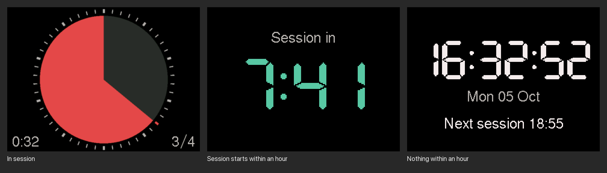

# focusmate-hw

A desk display for [Focusmate](https://www.focusmate.com) sessions on an M5Stack Core2, in the spirit of a Time Timer. It reads your booked sessions from the Focusmate API and shows one of three screens:



- **In session:** a pie that starts full and empties clockwise a minute at a time, inside a ring with a tick per minute. The tick of the running minute is red. The bottom left corner shows the time left, like 0:15. When several sessions are booked back to back, the bottom right shows which one is running, like 3⁄4.
- **Session starts within an hour:** a countdown.
- **Otherwise:** the time, the date and when the next session starts.

The speaker plays two rising notes one minute before a session and three notes when it starts, and ticks quietly every second while it runs. Two descending notes at the same volume sound one minute before it ends.

## Setup

Install [PlatformIO](https://platformio.org), then create your secrets file:

```sh
cp src/secrets.example.h src/secrets.h
```

Fill in your 2.4 GHz Wi-Fi name and password, and your Focusmate API key (Focusmate settings page). `src/secrets.h` is ignored by git.

The time zone is set to Europe/Bratislava in `TIME_ZONE` at the top of `src/network.cpp`; change it to your own [POSIX time zone string](https://github.com/nayarsystems/posix_tz_db/blob/master/zones.csv).

Plug in the Core2 and flash it:

```sh
pio run -t upload
```

## How it works

- A background task asks `GET /v1/sessions` for the next 24 hours once a minute. A session you book or cancel shows up within a minute.
- The pie and the countdown run off the device's clock, which is synced from the internet, so they keep going between requests.
- The pie and its ticks are drawn at twice their size into an off-screen canvas in the Core2's PSRAM and shrunk onto the screen, which smooths their edges.
- The screen is at full brightness from 10 minutes before a session until it ends, and dimmed the rest of the time.
- The device has no sleep mode and is meant to stay on USB power.

## Screenshots from the device

The `debug` build adds serial commands that put test sessions on screen and send the screen's pixels back, which is how the picture above was made.

```sh
pio run -e debug -t upload
uv run --with pyserial --with pillow python tools/screenshot.py p tools/out/pie.png /dev/cu.usbserial-XXXX
```

The first argument is a string of commands sent before the capture: `p` pie, `b` pie as the third of four sessions in a row, `q` pie in its last minute, `c` countdown, `w` a session starting in 63 seconds (to hear the chimes), `n` clock with a later session, `e` nothing booked, `-` capture only. A test session lasts until the next real fetch, at most a minute.

Flash the normal build again when you're done.

## License

MIT, see [LICENSE](LICENSE).
